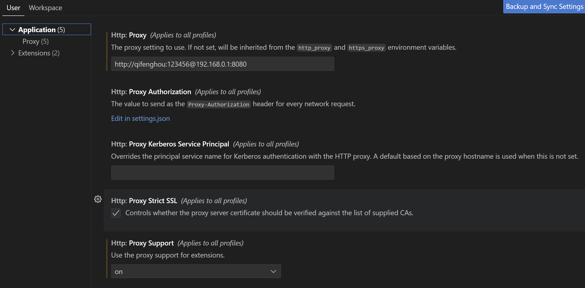

# mitmproxy-copilot

此代理服务器通过开源的 mitmproxy 实现，可以参考 [mitmproxy 官方文档](https://docs.mitmproxy.org/stable/) 进行使用。请务必确认不要修改HTTP请求中的任何字段信息，否则可能会被Github检测到并封禁账号；

此代理服务器的主要用于提供如下功能：
1. 记录开发者通过代理服务器上传到Github Copilot的代码片段上下文和生成的代码片段；
2. 用于记录通过开发者的活动信息；
3. 用于记录开发者的代码生成和接受数据；


为了简化 mitmproxy 的使用，建议通过容器化部署 mitmproxy-copilot，这样可以避免因为 mitmproxy 的版本不同导致的问题。

1. Dockerfile 用于生成 mitmproxy-copilot 镜像；
2. proxy-es.py 用于在mitmproxy中使用elasticsearch存储数据，可以通过此脚本对mitmproxy进行扩展；
3. creds.txt 用于存储用户名和密码，用于mitmproxy的认证，和记录访问的用户名；
4. 可以通过对proxy-es.py进行修改，实现更多的功能；


## 部署架构


## 资源配置

| 服务器 | 规格 | 数量 | 用途 |
| --- | --- | --- | --- |
| mitmproxy | 4C16G 200GDisk | 1 | 部署mitmproxy
| elasticsearch | 2C8G 500GDisk | 3 | 存储mitmproxy数据
| kibana | 2C8G 200GDisk | 1 | 可视化mitmproxy数据


## 使用方法

### 通过容器化部署 mitmproxy-copilot

1. 在部署mitmproxy的服务器上安装 Docker，参考 [Docker 安装文档](https://docs.docker.com/get-docker/)
```
yum install -y yum-utils
yum-config-manager --add-repo https://download.docker.com/linux/centos/docker-ce.repo
yum install docker-ce docker-ce-cli containerd.io docker-buildx-plugin docker-compose-plugin
```
2. 通过 Dockerfile 构建镜像，注意一定要在当前目录下执行
```
docker build . -t mitmproxy-copilot:v1
```

3. 运行容器
```
docker run -d --net="host" mitmproxy-copilot:v1 -v ./creds.txt:/app/creds.txt -v ./proxy-es.py:/app/proxy-es.py
```
### 已知问题

1. 密码为数字，或数字和字母组合，请不要包含特殊字符，否则可能会导致mitmproxy无法启动；

### 代理高可用部署


### 客户端配置

1. 安装mitmproxy 服务器信任证书，Mitmproxy 证书位于容器的如下目录：

在Windows 操作系统安装mitmproxy 证书，可以参考 [mitmproxy 官方文档](https://docs.mitmproxy.org/stable/concepts-certificates/#installing-the-mitmproxy-ca-certificate-on-windows)
```
certutil -addstore root mitmproxy-ca-cert.cer
```

2. 安装证书后，在IDE中启用代理配置：



配置项如下：

* Http:Proxy 采用如下格式：*http://用户名:密码@代理服务器地址:代理服务器端口*
* Http: Proxy Strict SSL 启用后，IDE会检查Mitmproxy代理服务器的证书。禁用后，IDE 不会检查Mitmproxy代理服务器的证书；

